# taxi hack

## A: Preparing the Database

1. download and set up PostGIS database for taxi 
adapted from [https://github.com/toddwschneider/nyc-taxi-data](https://github.com/toddwschneider/nyc-taxi-data)

- create table

```sql
CREATE TABLE yellow_tripdata_2017 (
  id serial primary key,
  vendor_id varchar,
  tpep_pickup_datetime varchar,
  tpep_dropoff_datetime varchar,
  passenger_count varchar,
  trip_distance varchar,
  rate_code_id varchar,
  store_and_fwd_flag varchar,
  pickup_location_id varchar,
  dropoff_location_id varchar,
  payment_type varchar,
  fare_amount varchar,
  extra varchar,
  mta_tax varchar,
  tip_amount varchar,
  tolls_amount varchar,
  improvement_surcharge varchar,
  total_amount varchar
);

```

- copy csv to database

```
\copy yellow_tripdata_2017 (vendor_id,tpep_pickup_datetime,tpep_dropoff_datetime,passenger_count,trip_distance,rate_code_id,store_and_fwd_flag,pickup_location_id,dropoff_location_id,payment_type,fare_amount,extra,mta_tax,tip_amount,tolls_amount,improvement_surcharge,total_amount) FROM 'C:/Users/base/Desktop/taxi hack/data/2017_Yellow_Taxi_Trip_Data.csv' CSV HEADER;
```

- optimize database and add columns

```sql
VACUUM ANALYZE yellow_tripdata_2017;

ALTER TABLE yellow_tripdata_2017
ADD COLUMN tstamp timestamp;

UPDATE yellow_tripdata_2017 SET tstamp = to_timestamp(tpep_pickup_datetime, 'MM/DD/YYYY HH:MI:SS AM');
```

it takes a long time for a query, wait
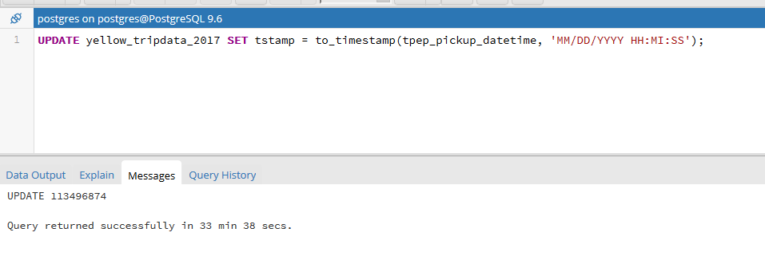

data queries adapted from [queries_2017.sql](https://github.com/toddwschneider/nyc-taxi-data/blob/master/analysis/2017_update/queries_2017.sql)

```sql
--get hour counts 
select extract(hour from tstamp) as hour , count(id) from yellow_tripdata_2017 group by hour
--get day of week counts
select extract(dow from tstamp) as doy , count(id) from yellow_tripdata_2017 group by doy
--get day of year counts
select extract(doy from tstamp) as doy , count(id) from yellow_tripdata_2017 group by doy
```
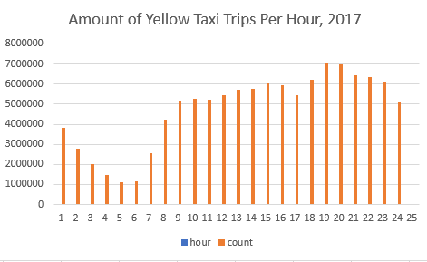
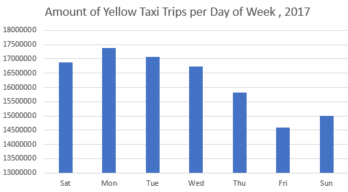
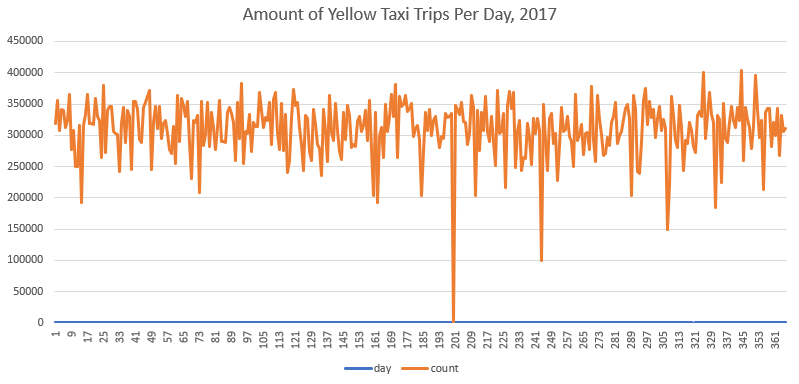

## B : Preparing the zones and routes

1. exporting to centroid to csv (qgis)
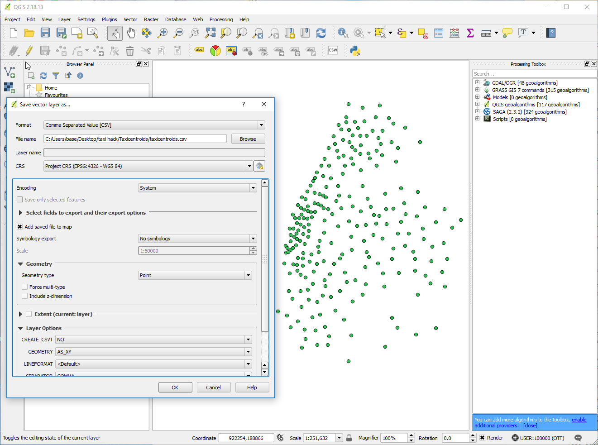

2. build distanceMatrix for query (python) , filtering out only rows that go from or to congestion zones to reduce values from 34452 to 11661
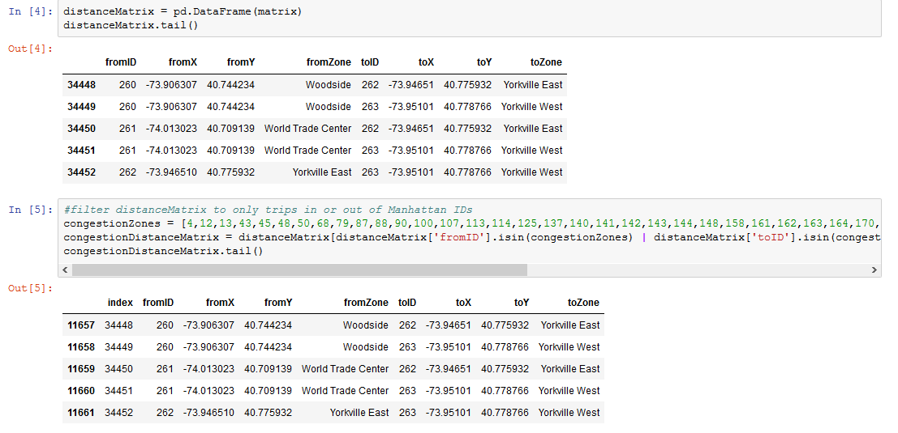

3. setting up google directions queries (python) , 4 time buckets 
- 8am Weekdays (6/6) - (morning rush-hours 6 - 10am) - 1
- 2pm Weekdays (6/6) - (non-rush hours) - 2
- 6pm Weekdays (6/6) - (night rush-hours 4 - 8pm) - 3 
- 2pm Weekends (6/9) - (non-rush hours) - 0

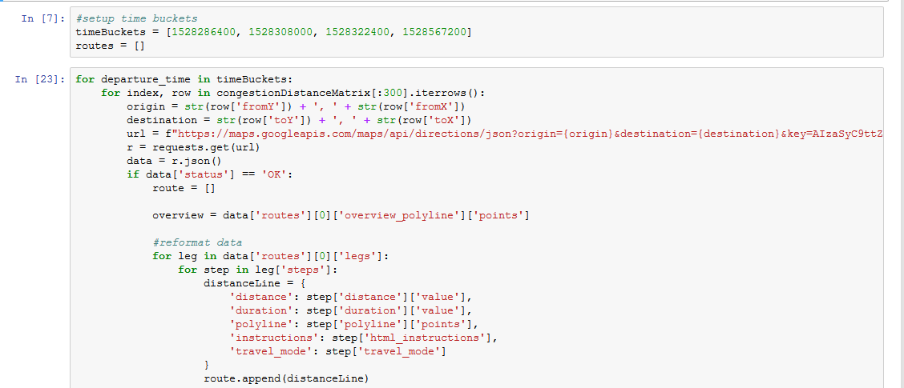


5. Running api queries and

Queries are done in chunks so it won't go over the 2500 limit (api resets at 3am) will take 4 days

Queries are joined back with distanceMatrix to get fromTo Ids
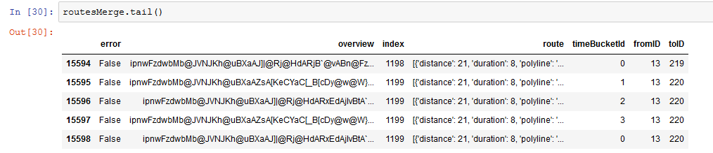

4. ZERO_RESULTS Error

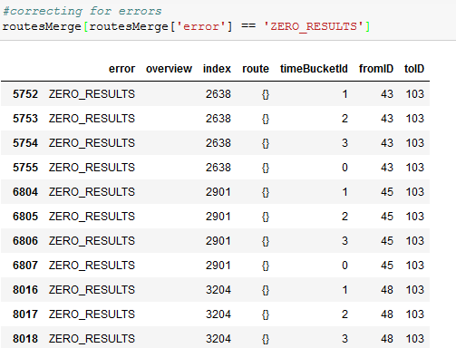

some routes returned with ZERO_RESULTS, they are ignored because those zones are islands

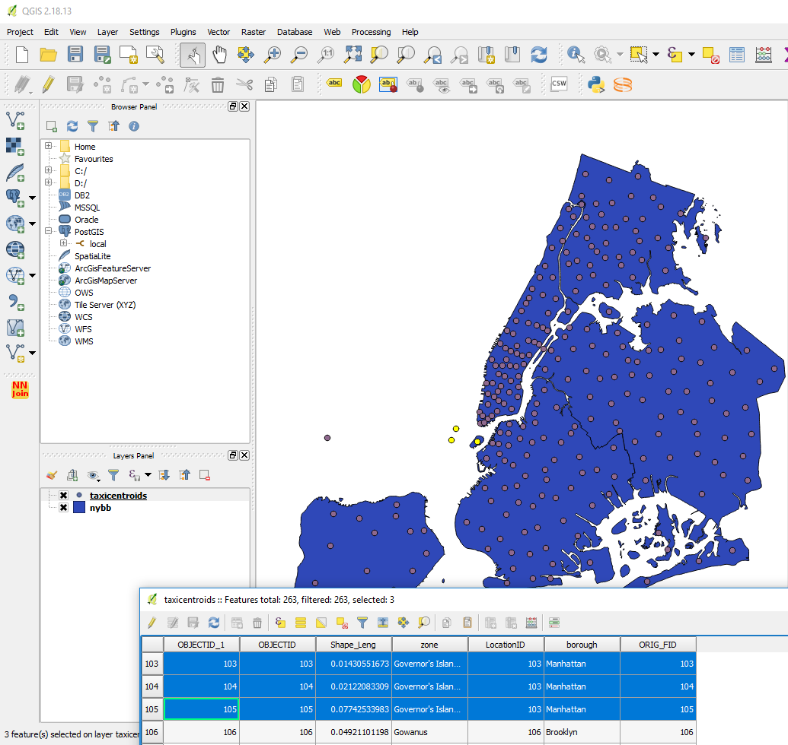


5. Processing route/leg information and uploading it to the database

Convert from Encoded Polyline to WKT Line because PostGIS [ST_LineFromEncodedPolyline](https://postgis.net/docs/ST_LineFromEncodedPolyline.html) doesn't work so well. Using [ST_GeomFromText](http://postgis.net/docs/ST_GeomFromText.html)

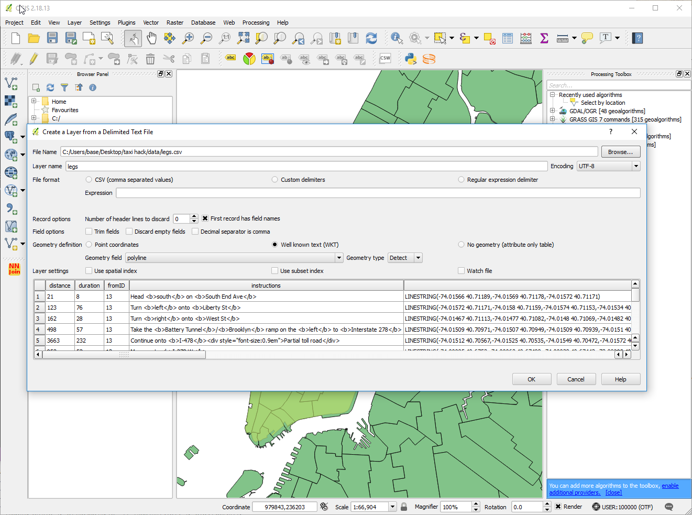

<!-- 
```sql
CREATE TABLE legs (
  id serial primary key,
  distance bigint,
  duration bigint,
  fromID integer,
  instructions varchar,
  polyline varchar,
  timeBucketId integer,
  toID integer,
  geom geometry
);

\copy legs (id,distance,duration,fromID,instructions,polyline,timeBucketId,toID) FROM 'C:/Users/base/Desktop/taxi hack/data/2017_Yellow_Taxi_Trip_Data.csv' CSV HEADER;

UPDATE legs SET geom = ST_GeomFromText(polyline,4269);

CREATE INDEX index_legs_on_geom ON legs USING geom;
VACUUM ANALYZE legs;
``` -->


## C: Preparing the database for joining

1. upload shapefile of the congestion zone using QGIS

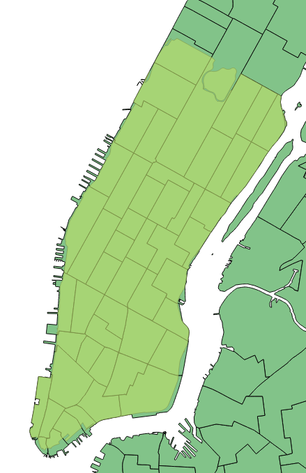


## D. Analysis

1. get counts group by time/date bucket, pickup_location_id, dropoff_location_id

```sql
select extract(hour from tstamp) as hour ,extract(dow from tstamp) as dow, pickup_location_id, dropoff_location_id,  count(id) from yellow_tripdata_2017 group by hour, dow, pickup_location_id, dropoff_location_id
```

use processCounts to put them into buckets


2. calcaute percentage in congestion zone of each route

Calcaute percentage of each leg

```sql
ALTER TABLE legs
ADD COLUMN inZone numeric;

UPDATE legs SET inZone = st_length(st_intersection(legs.geom, dissolved_newcongestionzone.geom))/st_length(legs.geom)FROM dissolved_newcongestionzone WHERE ST_Intersects(legs.geom, dissolved_newcongestionzone.geom)
```


export routes 
```sql
select fromid, toid, timebucket, inzone * distance as distance_inZone, inzone * duration as duration_inZone, geom from legs group by fromid, toid, timebucket
```

dissolve routes by fromid, toid and timebucket
```sql
select fromid, toid, timebucket, sum(inzone * distance) as distance_inZone, sum(inzone * duration) as duration_inZone, st_union(geom) as geom
from legs group by fromid, toid, timebucket
```
